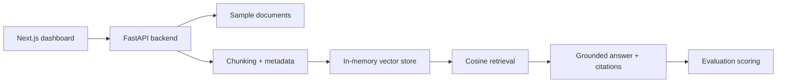

# Applied AI Eval Lab

Enterprise document intelligence and AI evaluation workspace.

The app demonstrates a full applied AI workflow: document ingestion, chunking,
retrieval, grounded answers, citations, evaluation metrics, failure visibility,
and production-minded local deployment.

## What It Shows

- Document parsing and chunking with source metadata.
- Local deterministic retrieval that runs without API keys.
- Grounded answer generation with citation evidence.
- Evaluation metrics for retrieval hit rate, citation coverage, latency, cost,
  and failure categories.
- A live dashboard for reviewing answers, evidence, and evaluation runs.
- Tests, Docker setup, typed API contracts, and clear development commands.

## Architecture



## Local Quickstart

Backend:

```bash
python3 -m venv .venv
source .venv/bin/activate
python -m pip install -e 'backend[dev]'
uvicorn app.main:app --app-dir backend --reload --port 8000
```

Frontend:

```bash
cd frontend
npm install
npm run dev
```

Open `http://localhost:3000`.

## Docker

```bash
docker compose up --build
```

Frontend runs on `http://localhost:3000`; backend runs on
`http://localhost:8000`.

## Public Static Demo

The frontend can also be exported as a static demo with safe sample data. This
mode does not need a backend or API keys.

```bash
cd frontend
npm run build:pages
```

The static files are written to `frontend/out`.

## Verification

Backend tests:

```bash
source .venv/bin/activate
cd backend
python -m pytest -q
```

Frontend checks:

```bash
cd frontend
npm audit --omit=dev
npm run typecheck
npm run build
```

## Demo Flow

1. Index the sample enterprise policy document.
2. Ask one of the starter questions.
3. Inspect the grounded answer and citations.
4. Review retrieved chunks and similarity scores.
5. Run the curated evaluation set.
6. Review retrieval hit rate, citation coverage, latency, and failures.

## Safety and Secrets

The initial release does not require external model providers or API keys. Local
configuration lives in `.env` files, and `.env.example` contains safe defaults
only. Real keys and private documents should never be committed.

## Current Limitations

- Retrieval uses deterministic token-frequency vectors for local repeatability.
- Answer generation is extractive and grounded to retrieved text.
- Uploaded PDF parsing and hosted deployment are planned follow-up milestones.
- Provider comparison, reranking, and persistent experiment storage are planned
  after the local v0.

## Project Docs

- [Enterprise AI Eval Lab design spec](docs/design/enterprise-ai-eval-lab.md)
