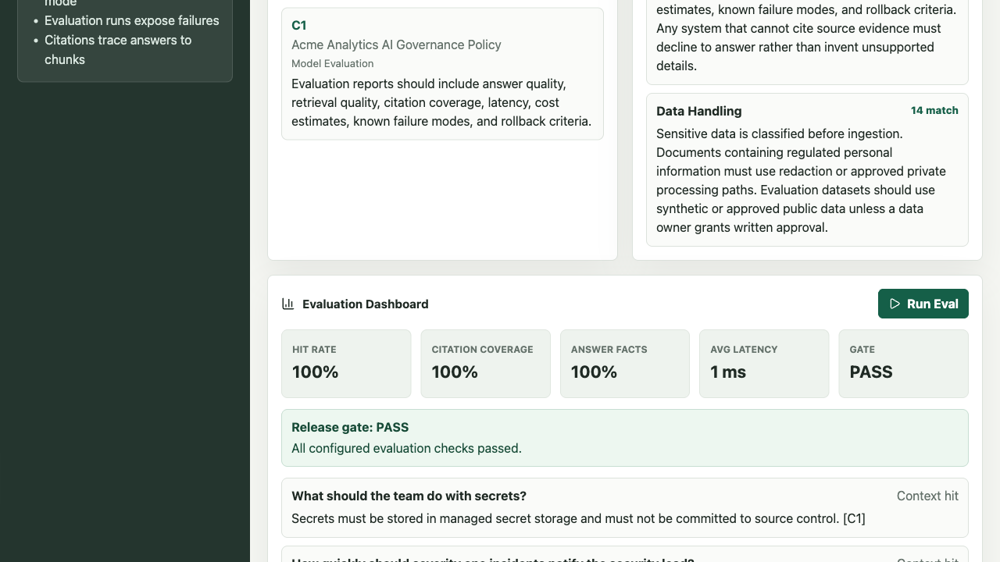
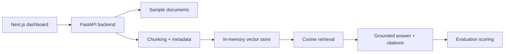

# Applied AI Eval Lab

Document intelligence and AI evaluation workspace.

The app demonstrates a practical applied AI workflow: document ingestion, chunking,
retrieval, grounded answers, citations, evaluation metrics, failure visibility,
and a deployment-aware local setup.

Live demo: https://goparapukethan.github.io/applied-ai-eval-lab/



## What It Shows

- Document parsing and chunking with source metadata.
- PDF, TXT, and Markdown upload support in API mode.
- Local deterministic retrieval that runs without API keys.
- Grounded answer generation with citation evidence.
- Evaluation metrics for retrieval hit rate, expected-answer fact coverage,
  citation coverage, latency, cost, and failure categories.
- Pass/warn/fail evaluation gate for release-style review.
- Experiment comparison for focused, balanced, and broad retrieval settings.
- Local JSON and Markdown report artifacts for evaluation and experiment runs.
- Report listing/detail endpoints for reviewing saved evaluation evidence.
- A live dashboard for reviewing answers, evidence, and evaluation runs.
- Tests, Docker setup, typed API contracts, and clear development commands.

## Architecture



## Local Quickstart

Backend:

```bash
python3 -m venv .venv
source .venv/bin/activate
python -m pip install -e 'backend[dev]'
uvicorn app.main:app --app-dir backend --reload --port 8000
```

Frontend:

```bash
cd frontend
npm install
npm run dev
```

Open `http://localhost:3000`.

## Docker

```bash
docker compose up --build
```

Frontend runs on `http://localhost:3000`; backend runs on
`http://localhost:8000`.

Repeatable Docker smoke check:

```bash
make docker-check
```

## Public Static Demo

The frontend can also be exported as a static demo with safe sample data. This
mode does not need a backend or API keys. Upload parsing remains available in
API mode so the public static page stays safe and deterministic.

```bash
cd frontend
npm run build:pages
```

The static files are written to `frontend/out`.

## Verification

Run the full local verification path from the repo root:

```bash
make verify
```

Or run the parts separately:

```bash
make test-backend
make audit
make verify-demo-data
make typecheck
make build
make build-pages
make verify-static-demo
make compose-check
make docker-check
```

Current verification status: backend tests pass (`21 passed`), frontend audit has
`0 vulnerabilities`, static demo data checks pass, typecheck/build/static export pass,
tracked static demo browser QA passes on desktop/mobile, and Docker Compose config parses
cleanly. The Docker smoke check builds the backend/dashboard stack and verifies health,
sample indexing, grounded query, evaluation, reports, dashboard CORS, and dashboard
readiness.

Latest local verification details: [docs/verification.md](docs/verification.md).

## Demo Flow

1. Index the sample enterprise policy document.
2. Ask one of the starter questions.
3. Inspect the grounded answer and citations.
4. Review retrieved chunks and similarity scores.
5. Run the curated evaluation set.
6. Review retrieval hit rate, answer-fact coverage, citation coverage, latency,
   failures, and the evaluation gate verdict.
7. Run the experiment comparison to inspect retrieval tradeoffs.
8. Inspect local JSON/Markdown report artifacts under `artifacts/reports` in API mode.
9. Use `/reports`, `/reports/{filename}`, or `/reports/{filename}/markdown` to review
   saved report evidence through the API.

## Safety and Secrets

The initial release does not require external model providers or API keys. Local
configuration lives in `.env` files, and `.env.example` contains safe defaults
only. Real keys and private documents should never be committed.

## Current Limitations

- Retrieval uses deterministic token-frequency vectors for local repeatability.
- Answer generation is extractive and grounded to retrieved text.
- Hosted backend deployment is planned after deployment credentials are
  available.
- Private provider adapters and reranking are planned follow-up milestones.

## Project Docs

- [Applied AI Eval Lab design spec](docs/design/enterprise-ai-eval-lab.md)
- [Model card](docs/model-card.md)
- [Data card](docs/data-card.md)
- [Case study](docs/case-study.md)
- [Verification](docs/verification.md)

## License

MIT. See [LICENSE](LICENSE).
