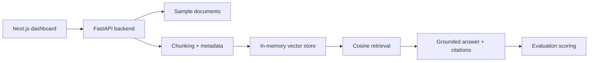

# Applied AI Eval Lab

Document intelligence and AI evaluation workspace.

The app demonstrates a practical applied AI workflow: document ingestion, chunking,
retrieval, grounded answers, citations, evaluation metrics, failure visibility,
and a deployment-aware local setup.

Live demo: https://goparapukethan.github.io/applied-ai-eval-lab/

## What It Shows

- Document parsing and chunking with source metadata.
- PDF, TXT, and Markdown upload support in API mode.
- Local deterministic retrieval that runs without API keys.
- Grounded answer generation with citation evidence.
- Evaluation metrics for retrieval hit rate, citation coverage, latency, cost,
  and failure categories.
- Experiment comparison for focused, balanced, and broad retrieval settings.
- Local JSON report artifacts for evaluation and experiment runs.
- A live dashboard for reviewing answers, evidence, and evaluation runs.
- Tests, Docker setup, typed API contracts, and clear development commands.

## Architecture



## Local Quickstart

Backend:

```bash
python3 -m venv .venv
source .venv/bin/activate
python -m pip install -e 'backend[dev]'
uvicorn app.main:app --app-dir backend --reload --port 8000
```

Frontend:

```bash
cd frontend
npm install
npm run dev
```

Open `http://localhost:3000`.

## Docker

```bash
docker compose up --build
```

Frontend runs on `http://localhost:3000`; backend runs on
`http://localhost:8000`.

## Public Static Demo

The frontend can also be exported as a static demo with safe sample data. This
mode does not need a backend or API keys.

```bash
cd frontend
npm run build:pages
```

The static files are written to `frontend/out`.

## Verification

Backend:

```bash
source .venv/bin/activate
python -m pytest backend/tests
```

Frontend:

```bash
cd frontend
npm ci
npm audit --omit=dev
npm run typecheck
npm run build
npm run build:pages
```

Docker Compose:

```bash
docker compose config --quiet
```

Current verification status: backend tests pass (`15 passed`), frontend audit has
`0 vulnerabilities`, typecheck/build/static export pass, and Docker Compose config
parses cleanly.

## Demo Flow

1. Index the sample enterprise policy document.
2. Ask one of the starter questions.
3. Inspect the grounded answer and citations.
4. Review retrieved chunks and similarity scores.
5. Run the curated evaluation set.
6. Review retrieval hit rate, citation coverage, latency, and failures.
7. Run the experiment comparison to inspect retrieval tradeoffs.
8. Inspect local report artifacts under `artifacts/reports` in API mode.

## Safety and Secrets

The initial release does not require external model providers or API keys. Local
configuration lives in `.env` files, and `.env.example` contains safe defaults
only. Real keys and private documents should never be committed.

## Current Limitations

- Retrieval uses deterministic token-frequency vectors for local repeatability.
- Answer generation is extractive and grounded to retrieved text.
- Hosted backend deployment is planned after deployment credentials are
  available.
- Private provider adapters and reranking are planned follow-up milestones.

## Project Docs

- [Enterprise AI Eval Lab design spec](docs/design/enterprise-ai-eval-lab.md)
- [Model card](docs/model-card.md)
- [Data card](docs/data-card.md)
- [Case study](docs/case-study.md)

## License

MIT. See [LICENSE](LICENSE).
