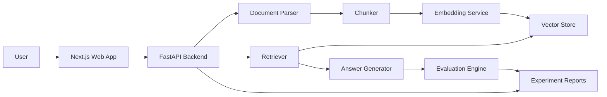

# Enterprise AI Eval Lab Design

## Purpose

Build a live enterprise-style AI/ML portfolio project that demonstrates practical
depth in document intelligence, retrieval augmented generation, AI evaluation,
experiment design, backend/frontend engineering, and production-minded tradeoffs.

The project should prove more than "I built a chatbot." It should show that the
system can ingest documents, retrieve evidence, generate grounded answers,
measure quality, expose failures, compare experiments, and present a reliable
reviewer experience.

## Product Summary

Applied AI Eval Lab is a web application for evaluating document Q&A systems.
Users can upload or select documents, ask questions, inspect answers with
citations, view retrieved chunks, and compare model/retrieval configurations.
The app includes evaluation reports that measure retrieval quality, answer
quality, citation coverage, latency, and estimated cost.

## Target Audience

- AI/ML hiring managers reviewing a candidate portfolio.
- ML engineers looking for evidence of applied modeling and evaluation skill.
- Product-minded technical reviewers who want a live demo, not only notebooks.
- Recruiters who need a quick, visual signal that the project is real and
  usable.

## Core Principles

- Live product first: every major capability should be visible in the web app.
- Evaluation is a first-class feature, not an afterthought.
- Reproducibility matters: setup, test, and evaluation commands must be clear.
- Keep the first version useful and small, then add enterprise layers.
- Use transparent experiment notes and failure analysis to show engineering
  judgment.

## User Experience

The first screen is the working application, not a marketing page.

Primary views:

1. Document Workspace
   - Upload supported documents or choose sample enterprise documents.
   - View document metadata, parsed sections, chunk count, and indexing status.
   - Re-index documents after changing chunking settings.

2. Ask and Cite
   - Ask a question against the active document collection.
   - Show answer, cited sources, retrieved chunks, confidence signals, latency,
     token usage, and configuration used for the run.
   - Allow reviewers to expand the evidence behind an answer.

3. Evaluation Dashboard
   - Run a small curated evaluation set.
   - Show answer quality, retrieval hit rate, citation coverage, hallucination
     flags, latency, and estimated cost.
   - Surface failed examples with expected answer, model answer, retrieved
     context, and failure reason.

4. Experiment Lab
   - Compare retrieval and generation settings across the same eval set.
   - Compare chunk size, overlap, top-k retrieval, reranking, prompt template,
     and model/provider configuration.
   - Save experiment results as versioned reports.

5. Production Notes
   - Show architecture, model/data cards, limitations, and runbook-style notes.
   - Keep this concise and reviewable from the repo and app.

## MVP Scope

Version 0 must include:

- A Next.js frontend with the main application shell.
- A FastAPI backend with endpoints for document ingestion, indexing, querying,
  and evaluation.
- Local sample documents committed under a safe sample-data directory.
- PDF/text parsing for sample documents and uploaded text/PDF files.
- Chunking and embeddings.
- A local vector store for development.
- RAG question answering with citations.
- Basic evaluation with 5 to 10 curated questions.
- Unit tests for chunking, citation mapping, and evaluation scoring.
- Integration smoke test for ingest to query flow.
- Docker setup for local run.
- README with setup, demo flow, test commands, and architecture summary.

## Enterprise Expansion Scope

After v0, add:

- Reranking support.
- Multi-experiment comparison.
- Cost and latency tracking by run.
- Structured logs and request IDs.
- Model card and data card.
- Failure taxonomy for evaluation examples.
- Exportable evaluation reports.
- Deployed frontend and backend.
- GitHub issues and PR history for each milestone.

## Non-Goals

- Do not build a generic chatbot without evaluation.
- Do not depend on private or sensitive documents.
- Do not claim production usage that has not happened.
- Do not optimize for artificial contribution streaks.
- Do not add complex Kubernetes infrastructure in the first release.

## Architecture

The system is split into a frontend app, backend API, document processing
pipeline, retrieval layer, generation layer, and evaluation layer.

## Backend Components

- `app/api`: FastAPI routers for health, documents, query, and evaluation.
- `app/core`: configuration, logging, and provider interfaces.
- `app/documents`: parsing, cleaning, chunking, metadata, and citation mapping.
- `app/retrieval`: vector store adapter, embedding adapter, retriever, reranker
  interface.
- `app/generation`: prompt construction, answer generation, and citation
  grounding.
- `app/evaluation`: eval dataset loading, scoring, failure classification, and
  report writing.
- `tests`: unit and integration tests.

## Frontend Components

- `app`: Next.js route structure.
- `components/workspace`: document upload, sample selection, and indexing status.
- `components/query`: question input, answer panel, citations, retrieved chunks,
  and run metadata.
- `components/evaluation`: metric cards, eval table, failure details, and
  experiment comparison controls.
- `lib/api`: typed API client.
- `lib/types`: shared frontend types.

## Data Flow

Document ingestion:

1. User uploads a document or selects a sample document.
2. Backend parses text and extracts metadata.
3. Text is cleaned and split into chunks.
4. Chunks are embedded and stored in the vector store.
5. Chunk IDs preserve source document, section, and page metadata.

Question answering:

1. User asks a question.
2. Backend embeds the query.
3. Retriever finds top matching chunks.
4. Generator receives the question, retrieved context, and citation rules.
5. Backend returns answer, citations, retrieved chunks, latency, and usage.

Evaluation:

1. Evaluation engine loads curated question/answer examples.
2. Each example runs through the same query endpoint.
3. Scorers compute retrieval hit, citation coverage, answer similarity, refusal
   correctness when applicable, latency, and cost estimate.
4. Failed examples are labeled with a failure category.
5. Results are stored as reports for the app and repo writeups.

## AI/ML Concepts Demonstrated

- Document parsing and preprocessing.
- Chunking strategy and information retrieval.
- Embedding-based semantic search.
- Retrieval augmented generation.
- Prompt design for grounded answers.
- Citation mapping and evidence inspection.
- Evaluation datasets and regression checks.
- Error analysis and failure taxonomy.
- Latency, cost, and quality tradeoffs.
- Reproducibility through tests, reports, and versioned configs.

## Model and Provider Strategy

The system should be provider-agnostic. Initial development can use one practical
LLM provider and one embedding provider, hidden behind interfaces so later runs
can compare providers.

Local development must support a mock generation path so tests do not require
network calls or paid API usage.

## Error Handling

- Invalid uploads return typed errors with clear user-facing messages.
- Empty documents are rejected before indexing.
- Query attempts against an empty index return a structured no-index response.
- LLM/provider failures return a recoverable error and preserve retrieved
  context for debugging.
- Evaluation runs continue after individual example failures and mark failed
  examples explicitly.

## Testing Strategy

Required tests:

- Chunking preserves source metadata.
- Citation mapper links answers to retrieved chunks.
- Evaluation scorers produce expected values for known examples.
- Query endpoint returns answer, citations, retrieved chunks, and run metadata.
- Empty index and invalid document cases return structured errors.

The local verification path should run formatting, linting, unit tests, and backend
smoke tests. Hosted CI can be added later if it is useful, but the project should stay
verifiable from a clean local setup.

## Repository and GitHub Strategy

- Create public repo `applied-ai-eval-lab`.
- Use `main` as the stable branch.
- Use feature branches for implementation slices.
- Create GitHub issues for each milestone.
- Use pull requests for major features.
- Pin the final repo on the GitHub profile.
- Add screenshots, demo link, architecture docs, model card, data card, and
  experiment reports as the project matures.

Initial milestone issues:

1. Scaffold app architecture and developer tooling.
2. Build document ingestion and chunking.
3. Add embeddings and vector retrieval.
4. Add RAG answer generation with citations.
5. Add curated evaluation dataset and scoring.
6. Build evaluation dashboard.
7. Add Docker, tests, and deployment docs.
8. Deploy live demo.

## Success Criteria

The first public release is successful when:

- A reviewer can open the live app and complete a document Q&A flow.
- The answer view shows citations and retrieved evidence.
- The eval dashboard shows at least one completed eval run.
- The repo has clear setup and test commands.
- Tests pass locally.
- The README explains architecture, results, limitations, and next steps.
- The project history shows incremental issues, commits, and PRs.

## Spec Self-Review

- No unresolved placeholders remain.
- Scope is focused on one flagship application with staged milestones.
- MVP can be implemented without private data or paid-only infrastructure.
- Enterprise features are staged after the usable v0, so the project can ship
  incrementally.
- The design avoids deceptive claims and relies on real process evidence.
